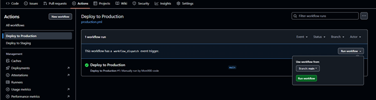

# Multi-Environment CI/CD Workflow (GitHub Actions)

##  What is Multiple Environment Deployment?
Let’s understand with a simple real-life example first. Imagine This:
You and your friend built an app called **"NoteBee"**, where users can store their to-do lists.
Now, you’ve added a **new feature**:  “Voice-to-Note” – Users speak, and it converts to a note automatically.
###  Would you roll it out to everyone directly?
> ❌ No way! Because: **What if there’s a bug and it crashes the app?**

Instead, you want to test it yourself first, then allow a small internal team to test it, and **only then make it public**.

##  That’s where **Multiple Environment Deployment** comes in
If your new NoteBee feature crashes in staging?
No worries!  
- Your real users won’t even know it existed.  
- You fix it → push again → test again → then go live with confidence.


Finally, we say that, Multiple Enviroments is the process of releasing your app through **different Environments** (Development → Staging → Production) to ensure quality before going live.

## 🔖 Easy Breakdown of Environments:

| Environment     | Who uses it?         | Purpose                       | Trigger                        |
|-----------------|----------------------|-------------------------------|--------------------------------|
| **Development** | Developer (you)      | Code writing, local testing   | Run locally                    |
| **Staging**     | QA team / Teammates  | Pre-live testing on server    | Automatically on push to `main` |
| **Production**  | Real users           | Live application              | Manual trigger with approval   |

---

##  Practical Flow :


###  Why use it?

- Catch bugs early without harming real users
- Reduce risk in production
- Safe testing ground for new features

###  When should you use it?

- Releasing a new feature
- Major code refactoring
- Updating infrastructure or backend logic

###  Where is it used?

- GitHub Actions (CI/CD)
- AWS CodeDeploy
- Azure Pipelines
- Kubernetes deployments


--- 

## Task Goal:
To deploy the application to two different environments:
- **Staging** (automatic on push)
- **Production** (manual trigger with reviewer approval)

---

## Folder Structure:
```
Canary_Deployment-/
├── .github/
│   └── workflows/
│       ├── staging.yml
│       └── production.yml
├── README.md
```

---

## Step-by-Step Workflow Setup:

### Step 1: Create Workflow Files

Create two workflow files with necessary content:
- `.github/workflows/staging.yml`
- `.github/workflows/production.yml`

> Note: Configure required reviewer for `production` environment in GitHub Settings → Environments.


---

## Step 2: Git Push Commands

After creating the workflows, push them:
```bash
git add .github/workflows/staging.yml .github/workflows/production.yml
git commit -m "Add multi-environment CI/CD workflows"
git push origin main
```

---

## GitHub Result Overview:

### Where to Find the Workflow Results:
1. Go to your GitHub Repository.
2. Click on the **Actions** tab.
3. Two workflows listed: `Deploy to Staging` and `Deploy to Production`.


### Staging Workflow Output:
- Triggered automatically on push to `main`.
- Shows log like:


### Production Workflow Output:
- Triggered manually via the **Run Workflow** button.
- If reviewer approval is set, it waits for approval.
- Logs will show:



## Output:


---
**That’s the beauty of Multiple Environment Deployment**:  
Safe, structured, and smart.   
